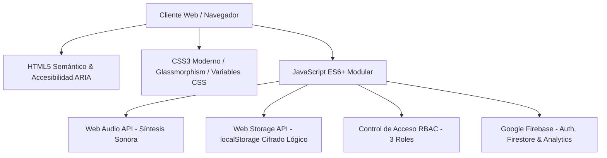
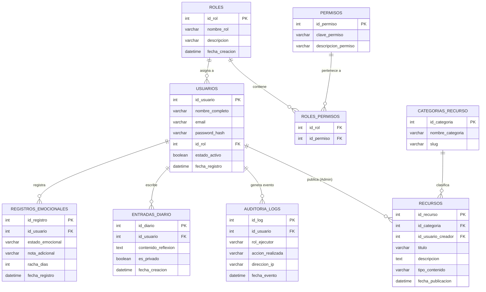
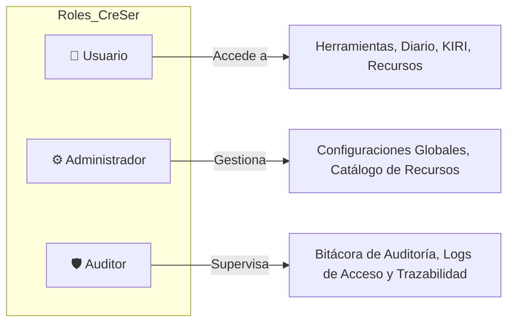

# CreSer — Plataforma de Bienestar Emocional y Crecimiento Personal

> **Documento Técnico de Arquitectura, Base de Datos, Control de Acceso y Ejecución**  
> *Un entorno digital accesible, modular y seguro diseñado para el autoconocimiento, la gestión de las emociones y la adopción de hábitos de vida saludables, acompañado por el asistente virtual de orientación **KIRI**.*

---

## 📑 Tabla de Contenidos

1. [1. README Técnico y Descripción General](#1-readme-técnico-y-descripción-general)
2. [2. Diagramación de Base de Datos (Modelo ER en 2FN)](#2-diagramación-de-base-de-datos-modelo-er-en-2fn)
3. [3. Interfaz y Desarrollo (Módulos Navegables)](#3-interfaz-y-desarrollo-módulos-navegables)
4. [4. Control de Versiones (Flujo Git & GitHub)](#4-control-de-versiones-flujo-git--github)
5. [5. Seguridad, Buenas Prácticas y Matriz de Roles (RBAC)](#5-seguridad-buenas-prácticas-y-matriz-de-roles-rbac)
6. [6. Ejecución de la Solución e Instrucciones](#6-ejecución-de-la-solución-e-instrucciones)

---

## 1. README Técnico y Descripción General

### 1.1 Propósito del Sistema
**CreSer** es una solución web multipágina (MPA) orientada a la salud preventiva y el acompañamiento emocional. Ofrece utilidades interactivas de autorregulación (respiración guiada, diario de gratitud, reproductor de paisajes sonoros nativos) y un canal de asistencia inteligente (**KIRI**).

### 1.2 Pila Tecnológica (Tech Stack)



- **Frontend Core**: HTML5 Semántico con estándares de accesibilidad (WAI-ARIA).
- **Estilos y Diseño**: CSS3 con Variables Personalizadas (*CSS Custom Properties*), Glassmorphism con `-webkit-backdrop-filter` y `backdrop-filter`, Grid y Flexbox.
- **Lógica e Interactividad**: JavaScript ES6+ desacoplado y estructurado de forma modular.
- **Backend & Cloud (Google Firebase)**:
  - **Firebase Auth**: Gestión segura de identidades y credenciales de acceso.
  - **Cloud Firestore**: Base de datos en tiempo real para sincronización de bienestar y auditoría.
  - **Firebase Analytics**: Telemetría ética para optimización de recursos.
- **Audio Nativo**: *Web Audio API* (`AudioContext`, `BiquadFilterNode`, `OscillatorNode`) sin dependencias externas.
- **Tipografías**: *Plus Jakarta Sans* y *Outfit* vía Google Fonts.

---

## 2. Diagramación de Base de Datos (Modelo ER en 2FN)

El diseño relacional del sistema se estructuró bajo la **Segunda Forma Normal (2FN)**, asegurando que:
1. Todos los atributos no clave dependan funcionalmente de la totalidad de la clave primaria (1FN + sin dependencias parciales).
2. Se elimine la redundancia dividiendo los roles, permisos, entradas de diario, registros de estado de ánimo y auditoría en tablas independientes interconectadas por llaves foráneas (`FK`).

### 2.1 Diagrama Entidad - Relación (Mermaid ER)



### 2.2 Diccionario de Datos y Justificación 2FN

| Tabla | Clave Primaria (PK) | Claves Foráneas (FK) | Dependencia Total y Normalización 2FN |
| :--- | :--- | :--- | :--- |
| **`ROLES`** | `id_rol` | N/A | Define los 3 niveles de privilegio (**Admin, Usuario, Auditor**). |
| **`PERMISOS`** | `id_permiso` | N/A | Acciones atómicas: `read_logs`, `manage_users`, `write_diary`, etc. |
| **`ROLES_PERMISOS`**| `(id_rol, id_permiso)` | `id_rol`, `id_permiso` | Tabla asociativa que elimina dependencias parciales. |
| **`USUARIOS`** | `id_usuario` | `id_rol` | Cada dato depende únicamente del `id_usuario`. |
| **`REGISTROS_EMOCIONALES`** | `id_registro` | `id_usuario` | Registro temporal del ánimo y racha sin duplicidad de usuario. |
| **`ENTRADAS_DIARIO`** | `id_diario` | `id_usuario` | Notas personales con control de privacidad local. |
| **`AUDITORIA_LOGS`** | `id_log` | `id_usuario` | Trazabilidad inmutable de eventos para inspección del Auditor. |

---

## 3. Interfaz y Desarrollo (Módulos Navegables)

La plataforma está dividida en páginas autónomas e interconectadas para evitar la sobrecarga de un solo archivo monolítico:

| Página | Ruta Local | Propósito Funcional |
| :--- | :--- | :--- |
| 🏠 **Inicio** | [`index.html`](file:///d:/Desktop/creser/index.html) | Presentación, métricas interactivas y pilares de cuidado. |
| 👑 **Panel Admin** | [`pages/admin.html`](file:///d:/Desktop/creser/pages/admin.html) | **Panel Administrativo (CMS)**: Edición en tiempo real de textos de la web, CRUD de recursos, directorio de ayuda y asignación de roles sin tocar código. |
| 💚 **Bienestar** | [`pages/bienestar.html`](file:///d:/Desktop/creser/pages/bienestar.html) | Selector de ánimo con retroalimentación y contador de racha. |
| 📚 **Recursos** | [`pages/recursos.html`](file:///d:/Desktop/creser/pages/recursos.html) | Buscador en tiempo real y filtrado de guías y podcasts. |
| 🫁 **Herramientas** | [`pages/herramientas.html`](file:///d:/Desktop/creser/pages/herramientas.html) | Respirador rítmico 4-4-4 y diario reflexivo privado. |
| 🤖 **KIRI** | [`pages/kiri.html`](file:///d:/Desktop/creser/pages/kiri.html) | Chat asistencial inteligente con respuestas contextuales. |
| 🎧 **Multimedia** | [`pages/multimedia.html`](file:///d:/Desktop/creser/pages/multimedia.html) | Generador sonoro (*Lluvia, Bosque, Olas, 432 Hz*) y visualizador. |
| 👥 **Comunidad** | [`pages/comunidad.html`](file:///d:/Desktop/creser/pages/comunidad.html) | Círculos de diálogo temáticos y normas de convivencia. |
| 🛟 **Ayuda** | [`pages/ayuda.html`](file:///d:/Desktop/creser/pages/ayuda.html) | Directorio de profesionales y teléfonos de emergencia 24/7. |
| 👤 **Perfil** | [`pages/perfil.html`](file:///d:/Desktop/creser/pages/perfil.html) | Modo oscuro, texto aumentado y bitácora de auditoría. |
| 🔐 **Acceso** | [`pages/login.html`](file:///d:/Desktop/creser/pages/login.html) | Formulario de acceso y registro con Google y correo. |
| 🔒 **Privacidad** | [`pages/privacidad.html`](file:///d:/Desktop/creser/pages/privacidad.html) | Política de Privacidad y Tratamiento de Datos Personales (ARCO). |
| 📄 **Términos** | [`pages/terminos.html`](file:///d:/Desktop/creser/pages/terminos.html) | Términos y Condiciones de Uso del Servicio. |
| 🍪 **Cookies** | [`pages/cookies.html`](file:///d:/Desktop/creser/pages/cookies.html) | Política de Cookies y Almacenamiento Local (localStorage). |
| 🤝 **Convivencia** | [`pages/convivencia.html`](file:///d:/Desktop/creser/pages/convivencia.html) | Normas de Convivencia y Seguridad Comunitaria. |
| ⚖️ **Aviso Legal** | [`pages/legal.html`](file:///d:/Desktop/creser/pages/legal.html) | Aviso Legal, Deslinde Médico y Tabla de Dominios Oficiales. |

### 3.1 Dominios Web Oficiales en Producción (Google Firebase)

| Dominio | Estado | Tipo |
| :--- | :--- | :--- |
| 🌐 **[https://cresernicaragua.web.app](https://cresernicaragua.web.app)** | Activo | Predeterminado |
| 🌐 **[https://cresernicaragua.firebaseapp.com](https://cresernicaragua.firebaseapp.com)** | Activo | Predeterminado |

---

## 4. Control de Versiones (Flujo Git & GitHub)

El proyecto cuenta con control de versiones en **Git** conectado al repositorio oficial:  
🔗 **[https://github.com/xolonica26/XOLONICA-CRESER](https://github.com/xolonica26/XOLONICA-CRESER)**

### 4.1 Tres Comandos Esenciales de Gestión

```bash
# 1. Confirmar cambios locales con mensajes legibles y semánticos
git add .
git commit -m "feat: implementar control de acceso por roles (Admin, Usuario, Auditor) y bitacora de auditoria"

# 2. Descargar e integrar actualizaciones remotas
git pull --rebase origin main

# 3. Publicar y sincronizar la rama principal en GitHub
git push origin main
```

---

## 5. Seguridad, Buenas Prácticas y Matriz de Roles (RBAC)

### 5.1 Definición de los 3 Roles del Sistema



1. **👤 Rol Usuario**:
   - Acceso a las funciones de autocuidado (Bienestar, Respirador, KIRI, Multimedia y Diario Personal).
   - Privacidad estricta: Sus notas de diario se almacenan localmente y no pueden ser vistas por otros usuarios.

2. **⚙️ Rol Administrador**:
   - Supervisión general del ecosistema y gestión de contenidos educativos.
   - Acceso a métricas globales de uso y visualización del panel de auditoría del sistema.

3. **🛡️ Rol Auditor**:
   - Privilegio de **Solo Lectura** sobre la bitácora de eventos y logs de seguridad (`Auditoría y Trazabilidad`).
   - Verificación del cumplimiento de políticas de privacidad, anonimización y registro de accesos.

### 5.2 Matriz de Permisos (RBAC Matrix)

| Módulo / Acción | Rol Usuario | Rol Administrador | Rol Auditor |
| :--- | :---: | :---: | :---: |
| **Página de Inicio y Recursos Educativos** | ✅ Lectura | ✅ Lectura / Edición | ✅ Lectura |
| **Respiración y Paisajes Sonoros** | ✅ Total | ✅ Total | ✅ Total |
| **Diario Personal y Registro Anímico** | ✅ Privado | ❌ Sin Acceso (Privacidad) | ❌ Sin Acceso (Privacidad) |
| **Orientación con KIRI** | ✅ Consulta | ✅ Consulta | ✅ Consulta |
| **Conmutador de Roles (Demostración)** | ✅ Permitido | ✅ Permitido | ✅ Permitido |
| **Bitácora de Auditoría y Trazabilidad** | ❌ Oculto / Restringido | ✅ Acceso Completo | ✅ Acceso Completo |
| **Exportación de Datos Locales (JSON)** | ✅ Propios | ✅ Todos | ✅ Todos |

### 5.3 Buenas Prácticas Aplicadas en el Código
- **Código Explicado Paso a Paso**: Cada bloque y función en `app.js`, `auth.js`, `main.css`, `auth.css` y archivos HTML cuenta con comentarios detallados que explican:
  - **¿Por qué?**: Justificación y necesidad de la lógica.
  - **¿Cómo?**: Mecanismo de implementación técnica.
  - **¿Para qué?**: Objetivo y beneficio para el usuario o sistema.
- **Sanitización contra XSS**: La función `escapeHtml()` neutraliza caracteres especiales (`<`, `>`, `&`, `"`) antes de renderizar entradas del usuario.
- **Accesibilidad WAI-ARIA**: Uso de roles `role="switch"`, `role="tab"`, `aria-checked` y `aria-label` en controles interactivos.

---

## 6. Ejecución de la Solución e Instrucciones

### 6.1 Pasos para Ejecutar Localmente

1. **Clonar el repositorio desde GitHub**:
   ```bash
   git clone https://github.com/xolonica26/XOLONICA-CRESER.git
   cd XOLONICA-CRESER
   ```

2. **Abrir en cualquier navegador moderno**:
   - Haz doble clic en el archivo `index.html` ubicado en la raíz del proyecto.
   - O inicia un servidor estático local (como *Live Server* en VS Code o `npx serve .`).

### 6.2 Recorrido de Demostración y Verificación

1. **Navegación Principal**: Accede a las páginas mediante la barra superior o el menú desplegable móvil.
2. **Prueba de Roles (RBAC)**:
   - Ve a `pages/login.html` y selecciona el rol **Administrador**, **Usuario** o **Auditor**.
   - En `pages/perfil.html`, utiliza el selector en tiempo real para alternar entre roles y observa cómo se actualiza la insignia y la tabla de **Bitácora de Auditoría y Trazabilidad**.
3. **Respirador 4-4-4**: En `pages/herramientas.html`, haz clic en *"Iniciar Respiración"* para ver el ciclo animado.
4. **Paisajes Sonoros**: En `pages/multimedia.html`, activa *"Lluvia Serena"* o *"Armonía 432 Hz"* y ajusta el volumen.
5. **Chat KIRI**: En `pages/kiri.html`, interactúa con las sugerencias rápidas o escribe una inquietud para recibir orientación inmediata.

---

## ⚠️ Uso Responsable y Ética en Salud Digital

> **Aviso Importante**: CreSer y el asistente virtual KIRI son herramientas digitales preventivas y psicoeducativas. **No constituyen un servicio de diagnóstico clínico ni reemplazan la atención médica o psicológica profesional**. Ante situaciones de crisis aguda o emergencia, contacta de inmediato a las líneas telefónicas oficiales de salud de tu localidad.

---

© 2026 **CreSer** — Plataforma de Bienestar Emocional y Cuidado Integral.